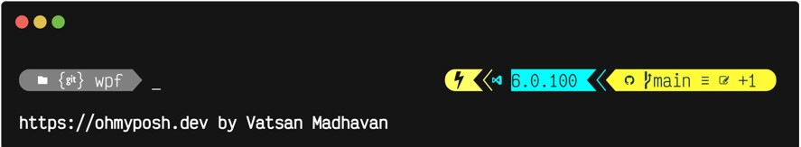

# Vatsan's Oh-My-Posh Theme

This is the [Oh-My-Posh](https://ohmyposh.dev) theme I use eveywhere.

It can be installed by doing the following:

- [Install and configure oh-my-posh](https://ohmyposh.dev/docs/)
- Copy [.mytheme.omp.json](.mytheme.omp.json) locally.
- `Set-PoshPrompt -Theme /path/to/.mytheme.omp.json`
